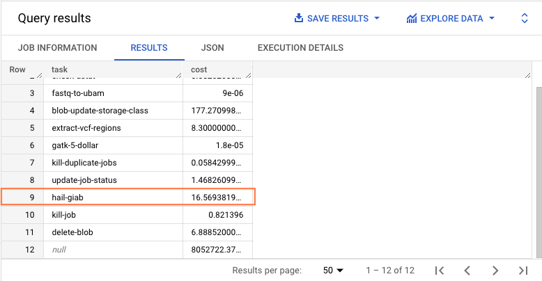

# Running Hail using Dataproc on Google Cloud Platform
## A Markdown presentation made using Marp
### Paul Billing-Ross
### October 21, 2022
### VA Big Data Genomics Group

A Markdown presentation made using [Marp](https://marp.app/)

Source: 
https://github.com/StanfordBioinformatics/effective-practices/blob/main/hail-on-gcp.md

---
# Running Hail on Dataproc

* Dataproc is a Google Cloud managed service for running Apache Spark and Apache Hadoop
  * Spark and Hadoop are open source tools for managing distributed computing clusters
* Why use Dataproc?
  * Many Hail operations require a lot of memory or CPUs
    * Dataproc cluster can automatically scale the cluster resources to meet current need
    * Cloud provides unlimited* resources to run very large tasks, distributed, very fast
  * Dataproc provides native monitoring utilities as well as configured web interfaces for interacting with tools like **JupyterLab**

---
# Using Hail to launch a Dataproc cluster

* Hail comes with a command line tool called `hailctl`
* [hailctl](https://hail.is/docs/0.2/cloud/google_cloud.html#hailctl-dataproc) provides a simple option for launching Dataproc clusters to run Hail

```
hailctl dataproc start CLUSTER_NAME [optional args...]
```

---
# Limitations of using hailctl to launch Dataproc clusters
* When using `hailctl` to connect to Jupyter, it launches a new local instance of your local browser
* Default configuration of `hailctl` jupyter is to use notebook, not lab
* The `hailctl` version of Jupyter does not support interacting with the local filesystem, only Google Cloud Storage
  * Why this matters
     * Notebook resources should be tracked and version controlled using Git
     * Local filesystem resources can be managed with Git
       * Use this [tutorial](https://cloud.google.com/vertex-ai/docs/workbench/user-managed/save-to-github) to connect to GitHub on a Dataproc master machine
    * Resources on Google Cloud Storage cannot be tracked using Git

---
# Workaround for launching Hail Dataproc clusters
* `hailctl` provides valuable methods for creating Dataproc clusters that are particularly configured to run Hail
  * **Goals:**
    * Keep the Hail configuration
    * Change the Jupyter configuration
* `hailctl` provides wrapper functions for interacting with dataproc
  * When you call these functions, it shows you the underlying commands its running
  * We can modify these commands to create a custom Hail cluster

---
# Recommendations for custom Hail Dataproc clusters

---
# Enable the component gateway 
* Use the Dataproc native method to connect to interfaces like **JupyterLab**
* Command line argument to enable gateway:
```
--enable-component-gateway \
--optional-components=JUPYTER \
```

---
# Use autoscaling
* Let Hail dynamically adjust computer resources to handle different jobs
* Write autoscaling policy in a separate YAML file and store in gcloud utility
* Take advantage of unlimited compute resources to complete task faster
* Only pay for resources when you use them

---
# Example autoscaling policy defined in YAML
  
```
workerConfig:
  maxInstances: 10
  minInstances: 2
  weight: 1
secondaryWorkerConfig:
  maxInstances: 50
  weight: 1
basicAlgorithm:
  cooldownPeriod: 2m
  yarnConfig:
    scaleUpFactor: 1.0 
    scaleDownFactor: 1.0
    gracefulDecommissionTimeout: 120s
```

**Note:** [Secondary workers](https://cloud.google.com/dataproc/docs/concepts/compute/secondary-vms) are only used to scale computing; their data storage is not connected to the Hadoop Distibuted File System (HDFS)

---
# Command to import autoscaling policy into gcloud utility:

```
gcloud dataproc autoscaling-policies \
    import hail-giab-autoscaling-policy \
    --source=hail-giab-autoscaling-policy.yaml
```

Command line argument to specify autoscaling when launching cluster:

```
--autoscaling-policy=hail-giab-autoscaling-policy
```

---
# Use labels to track Dataproc costs
  * Because the size of your cluster can scale dynamically can be difficult to estimate costs
  * Use labels to query exact costs from billing table
  
Command line argument to add labels:

```
--labels=creator=pbilling,environment=dev,task=hail-giab
```

---
# Example query to track Dataproc costs in BigQuery (1)
Cloud billing information is automatically exported to BigQuery, a high performance SQL database.

Our Dataproc resource labels:
```
--labels=creator=pbilling,environment=dev,task=hail-giab
```

Example query:
```
SELECT
  labels.value as task,
  SUM(cost) as cost
FROM `my-project-name.billing.gcp_billing_export_v1_0067C3_E44095_00D786`
LEFT JOIN UNNEST(labels) as labels
  ON labels.key = "task"
GROUP BY task
```

---
# Example query to track Dataproc costs in BigQuery (2)



---
# Use the cloud console to track cluster status
* Do **NOT** trust Dataproc to correctly manage your cluster
  * When you enable you also enable **burning money** :fire:
  * Regularly check that your cluster is scaling up **and down** as expected
* Stop your cluster when you aren't using it

More broadly...

* **Trust but validate**
    * Validate your computing resource behave as expected
    * Validate your data looks as expected
    * Validate your results are consistent with published results
* Allow others to validate your work
    * Make your analyses reproducible/replicable

---
# Command to create Dataproc cluster

```
gcloud dataproc clusters create pbilling-dataproc-hail-giab \
    --enable-component-gateway \
    --optional-components=JUPYTER \
    --image-version=2.0.44-debian10 \
    --properties="^|||^spark:spark.task.maxFailures=20|||spark:spark.driver.extraJavaOptions=-Xss4M|||spark:spark.executo[...]" \
    --metadata="^|||^WHEEL=gs://hail-common/hailctl/dataproc/0.2.98/hail-0.2.98-py3-none-any.whl|||PKGS=aiohttp==3.8.1|aioh[..]" \
    --master-machine-type=n1-highmem-8 \
    --master-boot-disk-size=1000GB \
    --num-master-local-ssds=0 \
    --num-secondary-workers=0 \
    --num-worker-local-ssds=0 \
    --num-workers=2 \
    --secondary-worker-boot-disk-size=1000GB \
    --worker-boot-disk-size=1000GB \
    --worker-machine-type=n1-highmem-8 \
    --initialization-action-timeout=20m \
    --labels=creator=pbilling,environment=dev,task=hail-giab \
    --autoscaling-policy=hail-giab-autoscaling-policy
```
